# Payment flow diagrams

Every payment flow, drawn. The text, the case tables and the backend asks are in [payment-flow.md](payment-flow.md).

- **Part A** is what we can build on today's backend.
- **Part B** is the ideal flow.

Endpoint ids are from `kmp-spec/15-api-reference.md`:
- B3: create an appointment;
- B5: cancel it;
- $1: consultation checkout;
- $2: treatment plan checkout;
- $3: payment status;
- V1: video token;
- X4: Shifa AI booking.

Each diagram marks what is unverified or not in the backend yet.

| # | Diagram |
|---|---|
| A1 | [Every way into a payment](#a1-every-way-into-a-payment) |
| A2 | [Booking to payment](#a2-booking-to-payment) |
| A3 | [Payment method and confirm trays](#a3-payment-method-and-confirm-trays) |
| A4 | [Checkout screen states](#a4-checkout-screen-states) |
| A5 | [Checkout calls](#a5-checkout-calls) |
| A6 | [Payment pending screen](#a6-payment-pending-screen) |
| A7 | [Paying later](#a7-paying-later) |
| A8 | [Joining an unpaid video visit](#a8-joining-an-unpaid-video-visit) |
| A9 | [App closed or killed mid-payment](#a9-app-closed-or-killed-mid-payment) |
| A10 | [Polling problems](#a10-polling-problems) |
| A11 | [Payment status of an appointment](#a11-payment-status-of-an-appointment) |
| A12 | [Cancel, doctor cancel and reschedule](#a12-cancel-doctor-cancel-and-reschedule) |
| A13 | [Shifa AI booking](#a13-shifa-ai-booking) |
| A14 | [Treatment plan and installments](#a14-treatment-plan-and-installments) |
| B1 | [Ideal booking and payment](#b1-ideal-booking-and-payment) |
| B2 | [Slot hold](#b2-slot-hold) |
| B3 | [Full payment status](#b3-full-payment-status) |
| B4 | [Payment methods](#b4-payment-methods) |
| B5 | [Ideal calls, with webhook and push](#b5-ideal-calls-with-webhook-and-push) |
| B6 | [Result screens](#b6-result-screens) |
| B7 | [Refunds and reschedule](#b7-refunds-and-reschedule) |
| B8 | [Pay later with a deadline](#b8-pay-later-with-a-deadline) |

---

# Part A: today's backend

## A1. Every way into a payment

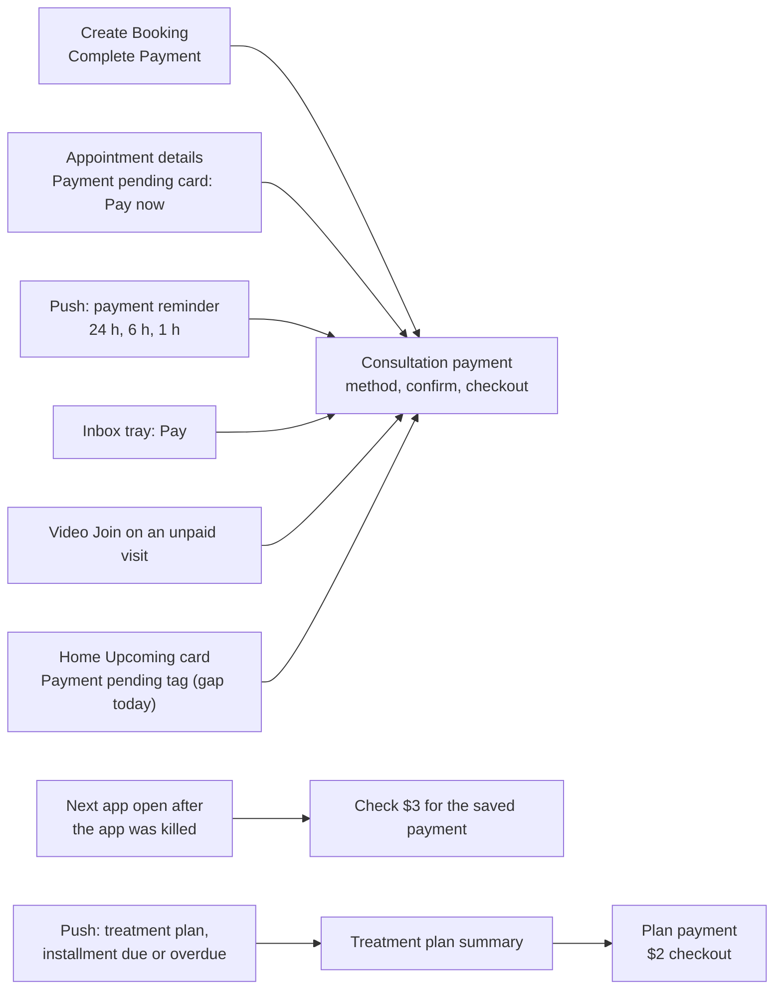
```mermaid
flowchart LR
  CB["Create Booking<br/>Complete Payment"] --> PAY
  DET["Appointment details<br/>Payment pending card: Pay now"] --> PAY
  PUSH["Push: payment reminder<br/>24 h, 6 h, 1 h"] --> PAY
  INBOX["Inbox tray: Pay"] --> PAY
  JOIN["Video Join on an unpaid visit"] --> PAY
  HOME["Home Upcoming card<br/>Payment pending tag (gap today)"] --> PAY
  RESUME["Next app open after<br/>the app was killed"] --> CHECK["Check $3 for the saved payment"]
  PAY["Consultation payment<br/>method, confirm, checkout"]
  TPPUSH["Push: treatment plan,<br/>installment due or overdue"] --> PLAN["Treatment plan summary"]
  PLAN --> TPPAY["Plan payment<br/>$2 checkout"]
```

## A2. Booking to payment

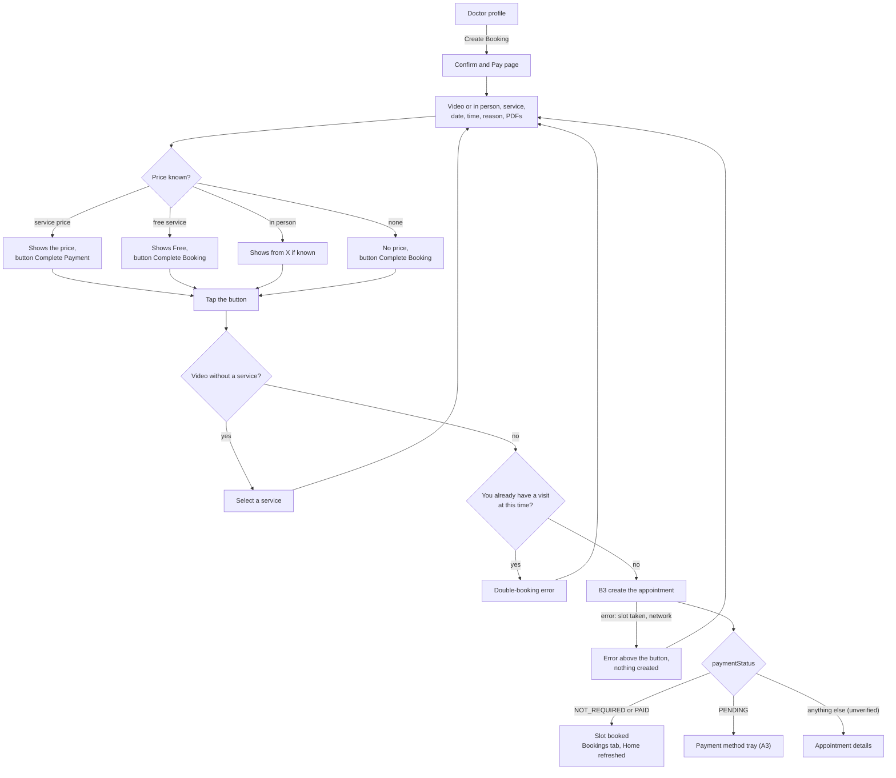
```mermaid
flowchart TD
  P["Doctor profile"] -->|Create Booking| C["Confirm and Pay page"]
  C --> PICK["Video or in person, service,<br/>date, time, reason, PDFs"]
  PICK --> PRICE{"Price known?"}
  PRICE -->|"service price"| SHOW["Shows the price,<br/>button Complete Payment"]
  PRICE -->|"free service"| FREE["Shows Free,<br/>button Complete Booking"]
  PRICE -->|"in person"| FROM["Shows from X if known"]
  PRICE -->|"none"| NONE["No price,<br/>button Complete Booking"]
  SHOW --> TAP["Tap the button"]
  FREE --> TAP
  FROM --> TAP
  NONE --> TAP
  TAP --> V1{"Video without a service?"}
  V1 -->|yes| ERR1["Select a service"] --> PICK
  V1 -->|no| V2{"You already have a visit<br/>at this time?"}
  V2 -->|yes| ERR2["Double-booking error"] --> PICK
  V2 -->|no| B3["B3 create the appointment"]
  B3 -->|"error: slot taken, network"| ERR3["Error above the button,<br/>nothing created"] --> PICK
  B3 --> PS{"paymentStatus"}
  PS -->|"NOT_REQUIRED or PAID"| DONE["Slot booked<br/>Bookings tab, Home refreshed"]
  PS -->|"PENDING"| METHOD["Payment method tray (A3)"]
  PS -->|"anything else (unverified)"| DET["Appointment details"]
```

## A3. Payment method and confirm trays

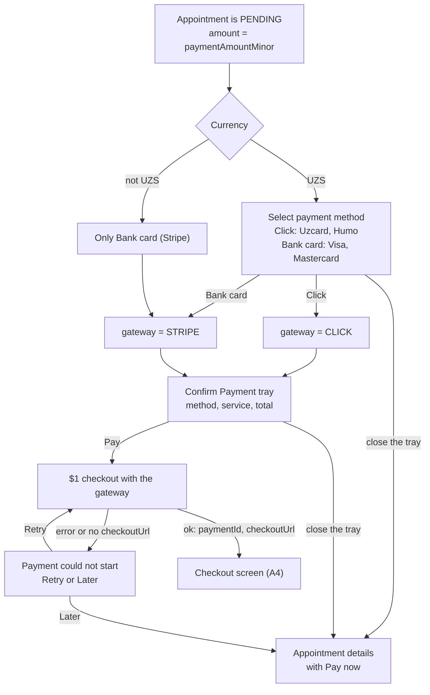
```mermaid
flowchart TD
  IN["Appointment is PENDING<br/>amount = paymentAmountMinor"] --> CUR{"Currency"}
  CUR -->|UZS| M["Select payment method<br/>Click: Uzcard, Humo<br/>Bank card: Visa, Mastercard"]
  CUR -->|"not UZS"| MC["Only Bank card (Stripe)"]
  M -->|Click| G1["gateway = CLICK"]
  M -->|"Bank card"| G2["gateway = STRIPE"]
  MC --> G2
  M -->|"close the tray"| LATER["Appointment details<br/>with Pay now"]
  G1 --> CONF["Confirm Payment tray<br/>method, service, total"]
  G2 --> CONF
  CONF -->|"close the tray"| LATER
  CONF -->|Pay| S1["$1 checkout with the gateway"]
  S1 -->|"error or no checkoutUrl"| E1["Payment could not start<br/>Retry or Later"]
  E1 -->|Retry| S1
  E1 -->|Later| LATER
  S1 -->|"ok: paymentId, checkoutUrl"| W["Checkout screen (A4)"]
```

## A4. Checkout screen states

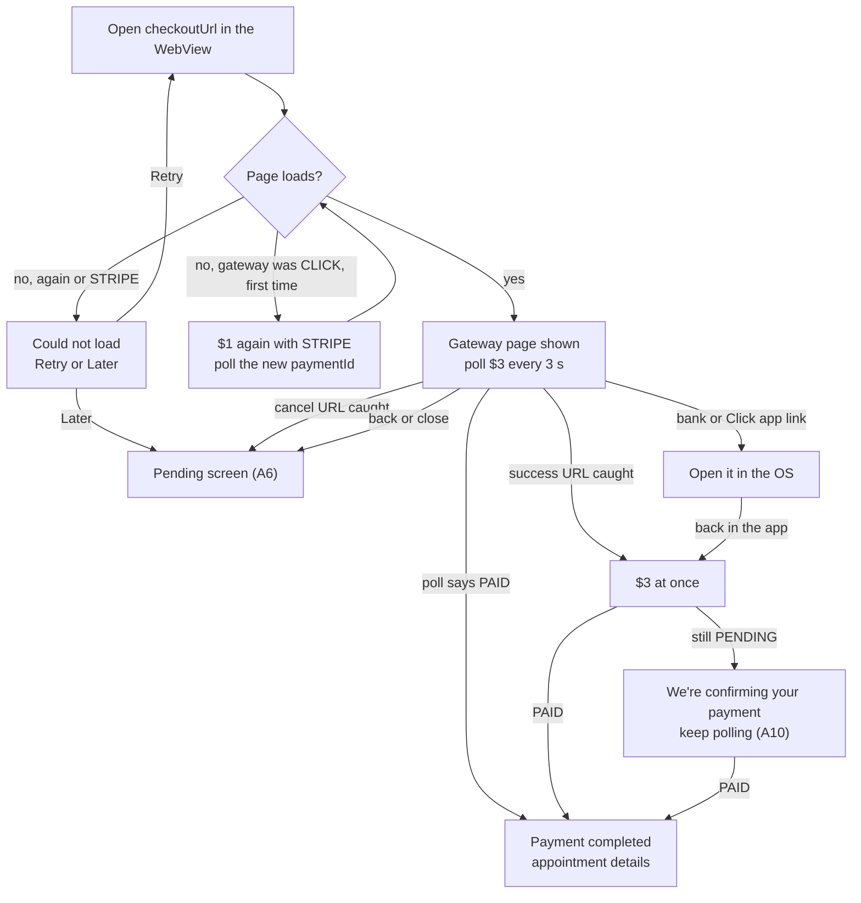
```mermaid
flowchart TD
  OPEN["Open checkoutUrl in the WebView"] --> LOAD{"Page loads?"}
  LOAD -->|yes| PAGE["Gateway page shown<br/>poll $3 every 3 s"]
  LOAD -->|"no, gateway was CLICK, first time"| FB["$1 again with STRIPE<br/>poll the new paymentId"] --> LOAD
  LOAD -->|"no, again or STRIPE"| LERR["Could not load<br/>Retry or Later"]
  LERR -->|Retry| OPEN
  LERR -->|Later| PEND["Pending screen (A6)"]
  PAGE -->|"poll says PAID"| PAID["Payment completed<br/>appointment details"]
  PAGE -->|"success URL caught"| CHK["$3 at once"]
  CHK -->|PAID| PAID
  CHK -->|"still PENDING"| CONF["We're confirming your payment<br/>keep polling (A10)"] -->|PAID| PAID
  PAGE -->|"cancel URL caught"| PEND
  PAGE -->|"back or close"| PEND
  PAGE -->|"bank or Click app link"| EXT["Open it in the OS"] -->|"back in the app"| CHK
```

## A5. Checkout calls

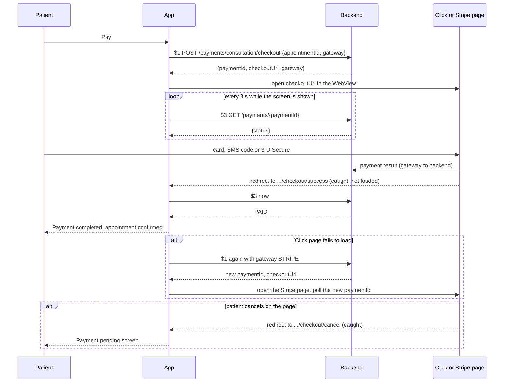
```mermaid
sequenceDiagram
  participant U as Patient
  participant App
  participant API as Backend
  participant G as Click or Stripe page
  U->>App: Pay
  App->>API: $1 POST /payments/consultation/checkout {appointmentId, gateway}
  API-->>App: {paymentId, checkoutUrl, gateway}
  App->>G: open checkoutUrl in the WebView
  loop every 3 s while the screen is shown
    App->>API: $3 GET /payments/{paymentId}
    API-->>App: {status}
  end
  U->>G: card, SMS code or 3-D Secure
  G->>API: payment result (gateway to backend)
  G-->>App: redirect to .../checkout/success (caught, not loaded)
  App->>API: $3 now
  API-->>App: PAID
  App-->>U: Payment completed, appointment confirmed
  alt Click page fails to load
    App->>API: $1 again with gateway STRIPE
    API-->>App: new paymentId, checkoutUrl
    App->>G: open the Stripe page, poll the new paymentId
  end
  alt patient cancels on the page
    G-->>App: redirect to .../checkout/cancel (caught)
    App-->>U: Payment pending screen
  end
```

## A6. Payment pending screen

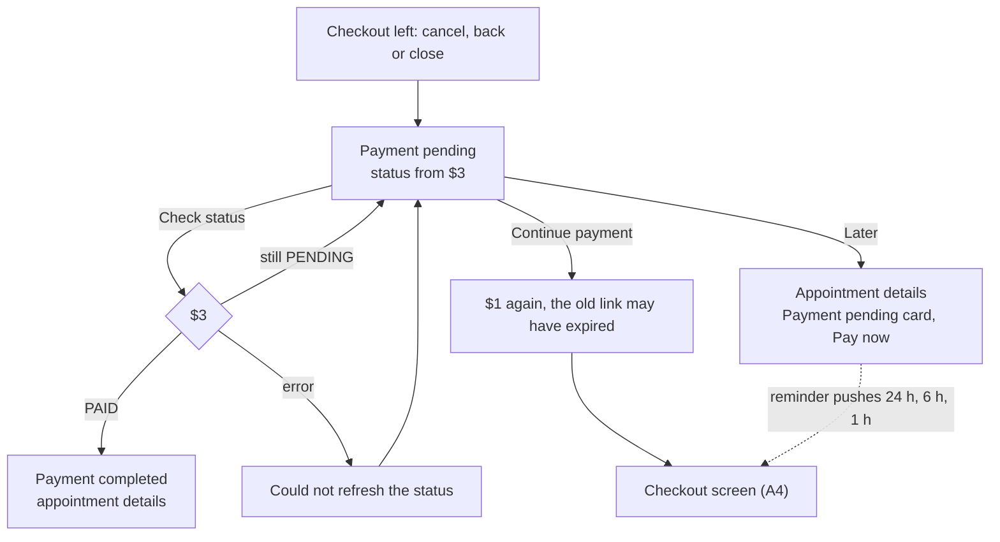
```mermaid
flowchart TD
  IN["Checkout left: cancel, back or close"] --> PS["Payment pending<br/>status from $3"]
  PS -->|"Check status"| C{"$3"}
  C -->|PAID| OK["Payment completed<br/>appointment details"]
  C -->|"still PENDING"| PS
  C -->|"error"| E["Could not refresh the status"] --> PS
  PS -->|"Continue payment"| NEW["$1 again, the old link may have expired"] --> W["Checkout screen (A4)"]
  PS -->|"Later"| DET["Appointment details<br/>Payment pending card, Pay now"]
  DET -.->|"reminder pushes 24 h, 6 h, 1 h"| W
```

## A7. Paying later

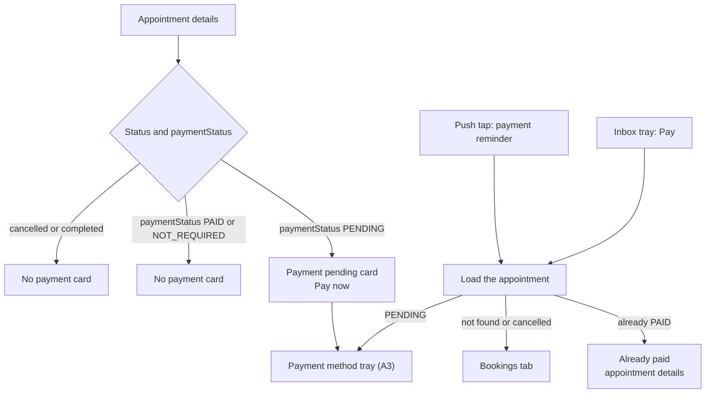
```mermaid
flowchart TD
  D["Appointment details"] --> S{"Status and paymentStatus"}
  S -->|"cancelled or completed"| NO["No payment card"]
  S -->|"paymentStatus PAID or NOT_REQUIRED"| NO2["No payment card"]
  S -->|"paymentStatus PENDING"| CARD["Payment pending card<br/>Pay now"]
  CARD --> METHOD["Payment method tray (A3)"]
  PU["Push tap: payment reminder"] --> LOAD["Load the appointment"]
  IB["Inbox tray: Pay"] --> LOAD
  LOAD -->|"not found or cancelled"| GONE["Bookings tab"]
  LOAD -->|"already PAID"| PAIDMSG["Already paid<br/>appointment details"]
  LOAD -->|PENDING| METHOD
```

## A8. Joining an unpaid video visit

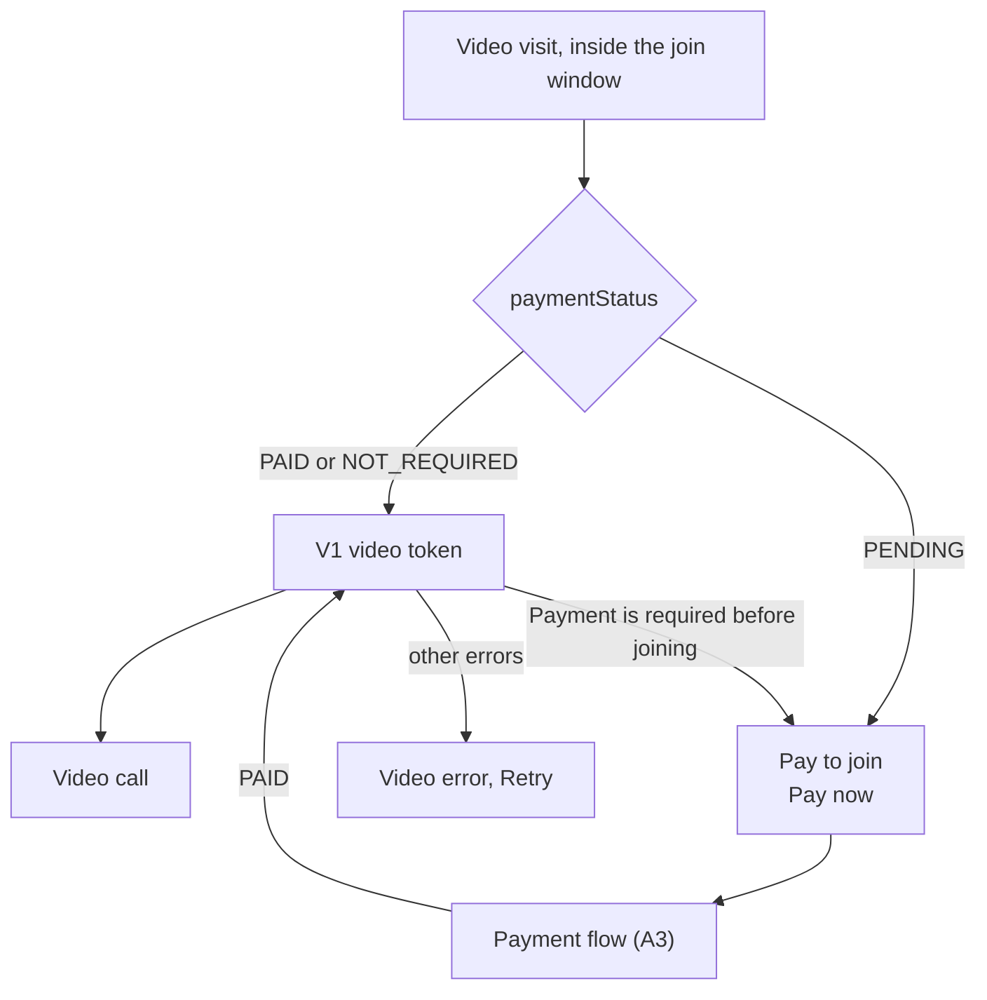
```mermaid
flowchart TD
  J["Video visit, inside the join window"] --> PS{"paymentStatus"}
  PS -->|"PAID or NOT_REQUIRED"| V1["V1 video token"] --> CALL["Video call"]
  PS -->|PENDING| P2J["Pay to join<br/>Pay now"]
  P2J --> PAY["Payment flow (A3)"] -->|PAID| V1
  V1 -->|"Payment is required before joining"| P2J
  V1 -->|"other errors"| VE["Video error, Retry"]
```

## A9. App closed or killed mid-payment

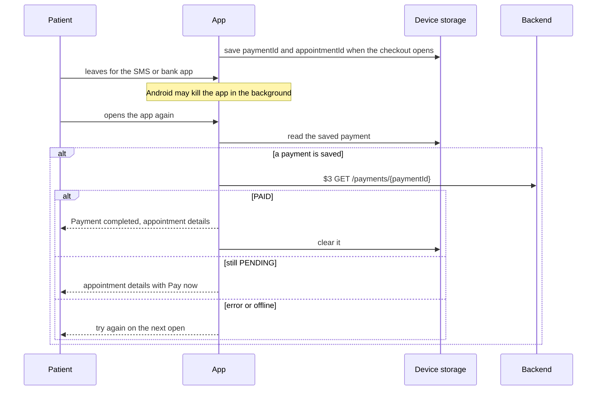
```mermaid
sequenceDiagram
  participant U as Patient
  participant App
  participant S as Device storage
  participant API as Backend
  App->>S: save paymentId and appointmentId when the checkout opens
  U->>App: leaves for the SMS or bank app
  Note over App: Android may kill the app in the background
  U->>App: opens the app again
  App->>S: read the saved payment
  alt a payment is saved
    App->>API: $3 GET /payments/{paymentId}
    alt PAID
      App-->>U: Payment completed, appointment details
      App->>S: clear it
    else still PENDING
      App-->>U: appointment details with Pay now
    else error or offline
      App-->>U: try again on the next open
    end
  end
```

## A10. Polling problems

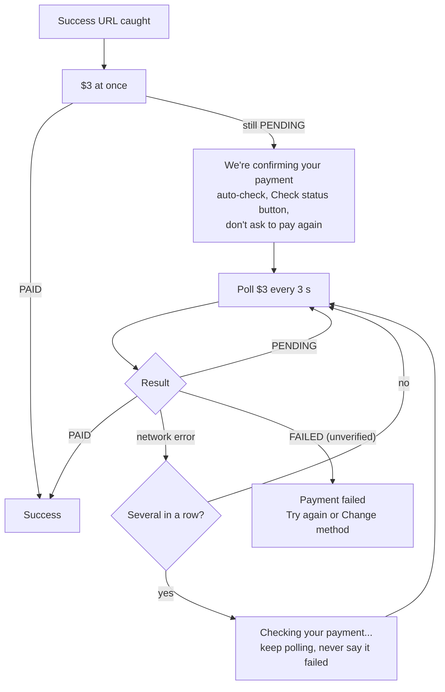
```mermaid
flowchart TD
  POLL["Poll $3 every 3 s"] --> R{"Result"}
  R -->|PAID| OK["Success"]
  R -->|PENDING| POLL
  R -->|"network error"| N{"Several in a row?"}
  N -->|no| POLL
  N -->|yes| CHK["Checking your payment...<br/>keep polling, never say it failed"] --> POLL
  R -->|"FAILED (unverified)"| F["Payment failed<br/>Try again or Change method"]
  SU["Success URL caught"] --> NOW["$3 at once"]
  NOW -->|PAID| OK
  NOW -->|"still PENDING"| CONF["We're confirming your payment<br/>auto-check, Check status button,<br/>don't ask to pay again"] --> POLL
```

## A11. Payment status of an appointment

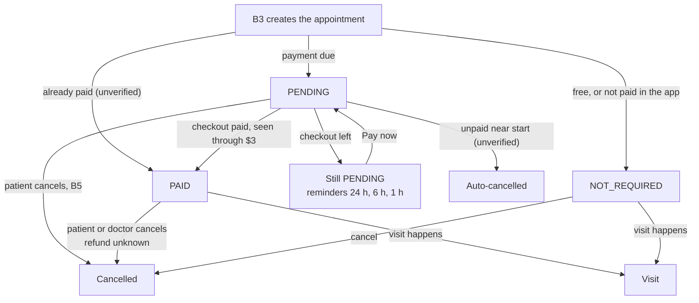
```mermaid
flowchart TD
  B3["B3 creates the appointment"] -->|"free, or not paid in the app"| NR["NOT_REQUIRED"]
  B3 -->|"payment due"| PE["PENDING"]
  B3 -->|"already paid (unverified)"| PA["PAID"]
  PE -->|"checkout paid, seen through $3"| PA
  PE -->|"checkout left"| REM["Still PENDING<br/>reminders 24 h, 6 h, 1 h"] -->|"Pay now"| PE
  PE -->|"patient cancels, B5"| CA["Cancelled"]
  PE -->|"unpaid near start (unverified)"| AC["Auto-cancelled"]
  PA -->|"patient or doctor cancels<br/>refund unknown"| CA
  NR -->|cancel| CA
  PA -->|"visit happens"| V["Visit"]
  NR -->|"visit happens"| V
```

## A12. Cancel, doctor cancel and reschedule

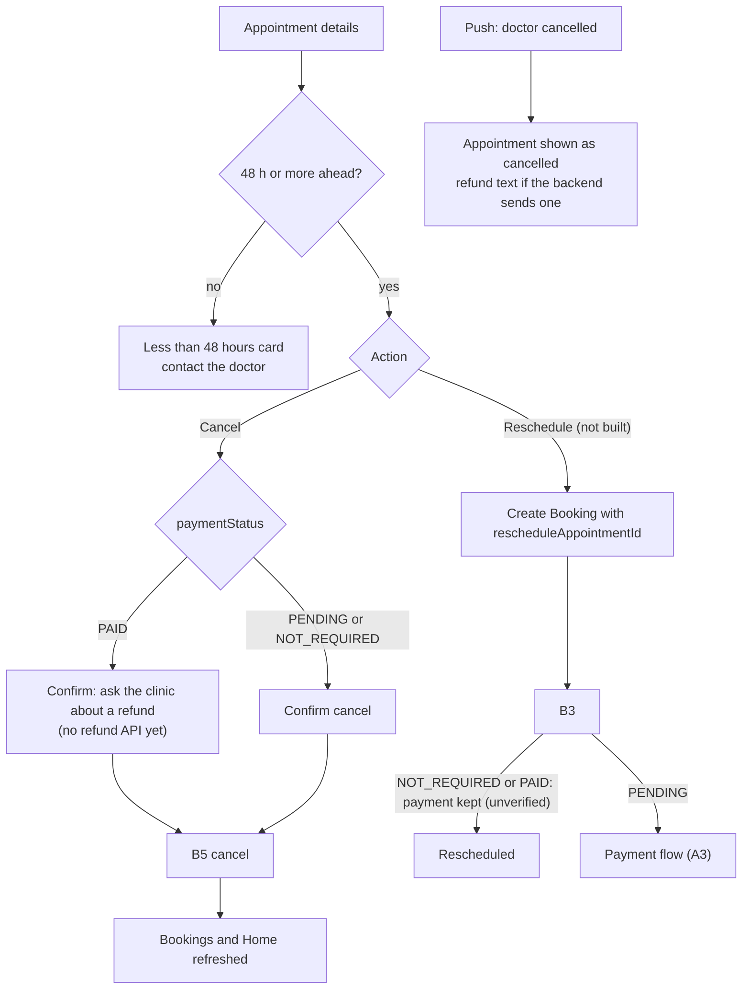
```mermaid
flowchart TD
  D["Appointment details"] --> H{"48 h or more ahead?"}
  H -->|no| W["Less than 48 hours card<br/>contact the doctor"]
  H -->|yes| A{"Action"}
  A -->|Cancel| P{"paymentStatus"}
  P -->|PAID| WARN["Confirm: ask the clinic about a refund<br/>(no refund API yet)"] --> B5["B5 cancel"]
  P -->|"PENDING or NOT_REQUIRED"| CONF["Confirm cancel"] --> B5
  B5 --> LIST["Bookings and Home refreshed"]
  A -->|"Reschedule (not built)"| RB["Create Booking with rescheduleAppointmentId"]
  RB --> B3["B3"]
  B3 -->|"NOT_REQUIRED or PAID: payment kept (unverified)"| OK["Rescheduled"]
  B3 -->|PENDING| PAY["Payment flow (A3)"]
  DOC["Push: doctor cancelled"] --> DD["Appointment shown as cancelled<br/>refund text if the backend sends one"]
```

## A13. Shifa AI booking

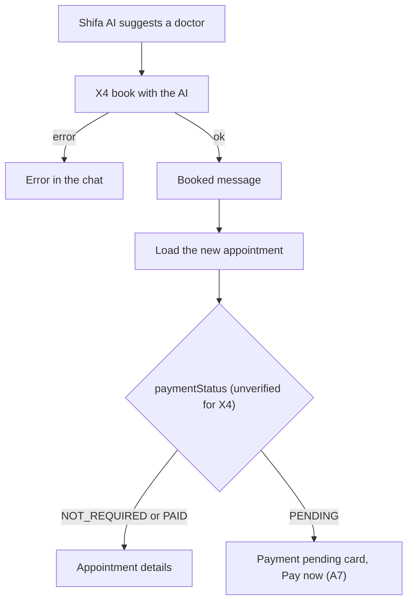
```mermaid
flowchart TD
  AI["Shifa AI suggests a doctor"] --> X4["X4 book with the AI"]
  X4 -->|error| E["Error in the chat"]
  X4 -->|ok| R["Booked message"]
  R --> B2["Load the new appointment"]
  B2 --> P{"paymentStatus (unverified for X4)"}
  P -->|"NOT_REQUIRED or PAID"| OK["Appointment details"]
  P -->|PENDING| PAY["Payment pending card, Pay now (A7)"]
```

## A14. Treatment plan and installments

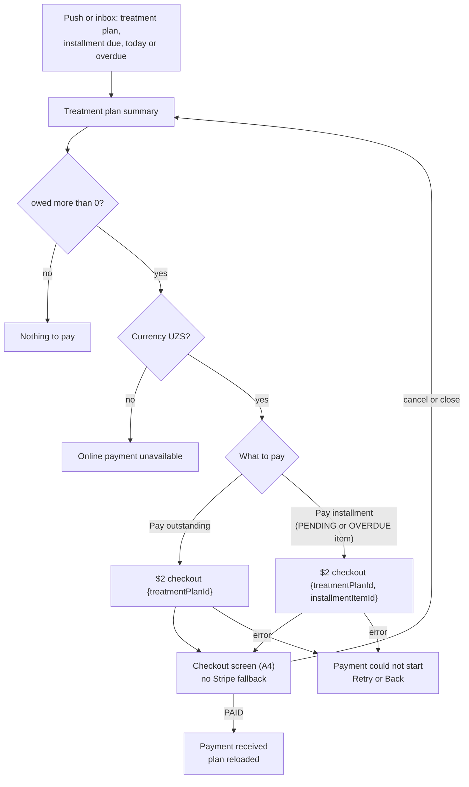
```mermaid
flowchart TD
  IN["Push or inbox: treatment plan,<br/>installment due, today or overdue"] --> PLAN["Treatment plan summary"]
  PLAN --> O{"owed more than 0?"}
  O -->|no| PAIDALL["Nothing to pay"]
  O -->|yes| CUR{"Currency UZS?"}
  CUR -->|no| NOPAY["Online payment unavailable"]
  CUR -->|yes| OPT{"What to pay"}
  OPT -->|"Pay outstanding"| S2["$2 checkout {treatmentPlanId}"]
  OPT -->|"Pay installment<br/>(PENDING or OVERDUE item)"| S2I["$2 checkout {treatmentPlanId, installmentItemId}"]
  S2 --> W["Checkout screen (A4)<br/>no Stripe fallback"]
  S2I --> W
  S2 -->|error| E["Payment could not start<br/>Retry or Back"]
  S2I -->|error| E
  W -->|PAID| BACK["Payment received<br/>plan reloaded"]
  W -->|"cancel or close"| PLAN
```

---

# Part B: the ideal flow

## B1. Ideal booking and payment

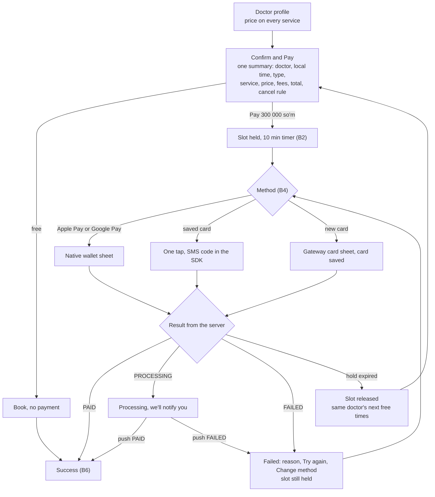
```mermaid
flowchart TD
  P["Doctor profile<br/>price on every service"] --> C["Confirm and Pay<br/>one summary: doctor, local time, type,<br/>service, price, fees, total, cancel rule"]
  C -->|"free"| BOOK["Book, no payment"] --> OK
  C -->|"Pay 300 000 so'm"| HOLD["Slot held, 10 min timer (B2)"]
  HOLD --> M{"Method (B4)"}
  M -->|"Apple Pay or Google Pay"| N["Native wallet sheet"]
  M -->|"saved card"| T["One tap, SMS code in the SDK"]
  M -->|"new card"| G["Gateway card sheet, card saved"]
  N --> R{"Result from the server"}
  T --> R
  G --> R
  R -->|PAID| OK["Success (B6)"]
  R -->|PROCESSING| PR["Processing, we'll notify you"]
  R -->|FAILED| F["Failed: reason, Try again, Change method<br/>slot still held"]
  R -->|"hold expired"| X["Slot released<br/>same doctor's next free times"]
  PR -->|"push PAID"| OK
  PR -->|"push FAILED"| F
  F --> M
  X --> C
```

## B2. Slot hold

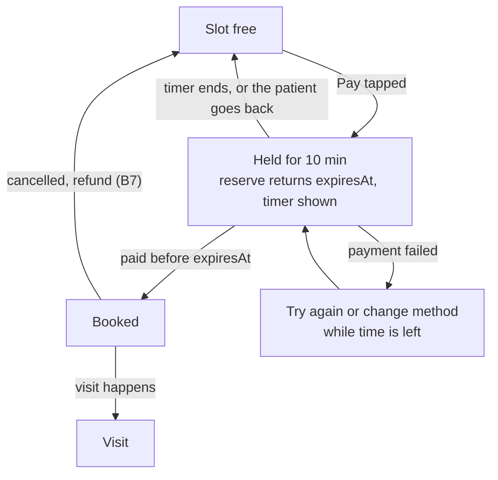
```mermaid
flowchart TD
  FREE["Slot free"] -->|"Pay tapped"| HELD["Held for 10 min<br/>reserve returns expiresAt, timer shown"]
  HELD -->|"paid before expiresAt"| BOOKED["Booked"]
  HELD -->|"payment failed"| RETRY["Try again or change method<br/>while time is left"] --> HELD
  HELD -->|"timer ends, or the patient goes back"| FREE
  BOOKED -->|"cancelled, refund (B7)"| FREE
  BOOKED -->|"visit happens"| VISIT["Visit"]
```

## B3. Full payment status

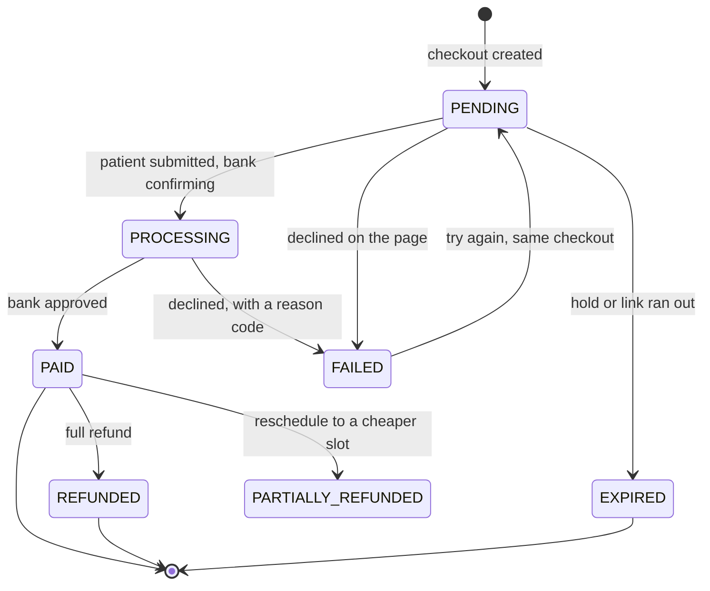
```mermaid
stateDiagram-v2
  [*] --> PENDING : checkout created
  PENDING --> PROCESSING : patient submitted, bank confirming
  PROCESSING --> PAID : bank approved
  PROCESSING --> FAILED : declined, with a reason code
  PENDING --> FAILED : declined on the page
  PENDING --> EXPIRED : hold or link ran out
  FAILED --> PENDING : try again, same checkout
  PAID --> REFUNDED : full refund
  PAID --> PARTIALLY_REFUNDED : reschedule to a cheaper slot
  PAID --> [*]
  REFUNDED --> [*]
  EXPIRED --> [*]
```

## B4. Payment methods

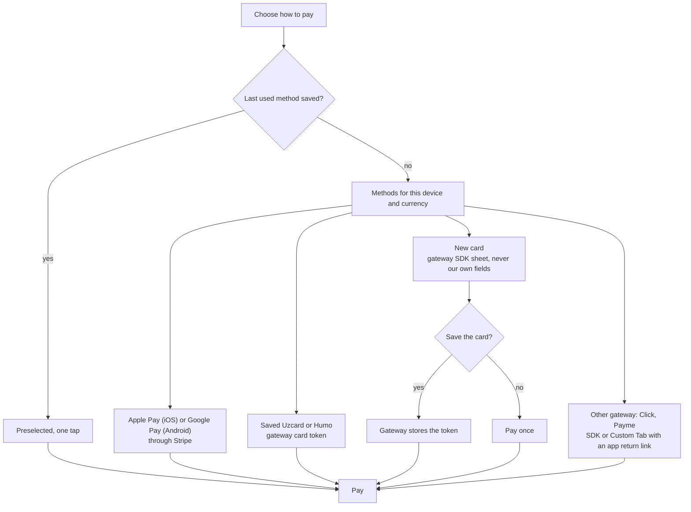
```mermaid
flowchart TD
  OPEN["Choose how to pay"] --> DEF{"Last used method saved?"}
  DEF -->|yes| PRE["Preselected, one tap"]
  DEF -->|no| LIST["Methods for this device and currency"]
  LIST --> AP["Apple Pay (iOS) or Google Pay (Android)<br/>through Stripe"]
  LIST --> SC["Saved Uzcard or Humo<br/>gateway card token"]
  LIST --> NC["New card<br/>gateway SDK sheet, never our own fields"]
  LIST --> OT["Other gateway: Click, Payme<br/>SDK or Custom Tab with an app return link"]
  NC --> SAVE{"Save the card?"}
  SAVE -->|yes| TOKEN["Gateway stores the token"]
  SAVE -->|no| ONCE["Pay once"]
  PRE --> PAYNOW["Pay"]
  AP --> PAYNOW
  SC --> PAYNOW
  TOKEN --> PAYNOW
  ONCE --> PAYNOW
  OT --> PAYNOW
```

## B5. Ideal calls, with webhook and push

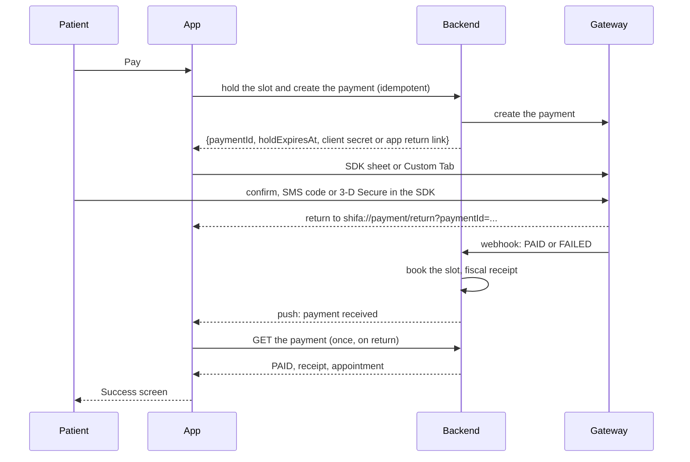
```mermaid
sequenceDiagram
  participant U as Patient
  participant App
  participant API as Backend
  participant G as Gateway
  U->>App: Pay
  App->>API: hold the slot and create the payment (idempotent)
  API->>G: create the payment
  API-->>App: {paymentId, holdExpiresAt, client secret or app return link}
  App->>G: SDK sheet or Custom Tab
  U->>G: confirm, SMS code or 3-D Secure in the SDK
  G-->>App: return to shifa://payment/return?paymentId=...
  G->>API: webhook: PAID or FAILED
  API->>API: book the slot, fiscal receipt
  API-->>App: push: payment received
  App->>API: GET the payment (once, on return)
  API-->>App: PAID, receipt, appointment
  App-->>U: Success screen
```

## B6. Result screens

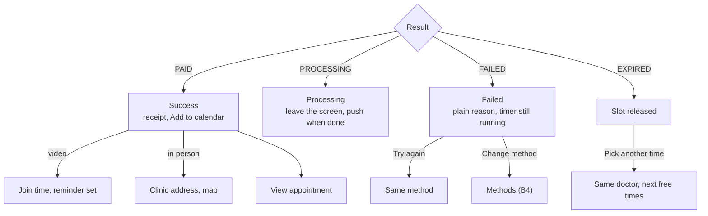
```mermaid
flowchart TD
  R{"Result"} -->|PAID| S["Success<br/>receipt, Add to calendar"]
  S -->|"video"| SV["Join time, reminder set"]
  S -->|"in person"| SP["Clinic address, map"]
  S --> VA["View appointment"]
  R -->|PROCESSING| PR["Processing<br/>leave the screen, push when done"]
  R -->|FAILED| F["Failed<br/>plain reason, timer still running"]
  F -->|"Try again"| RETRY["Same method"]
  F -->|"Change method"| CH["Methods (B4)"]
  R -->|EXPIRED| X["Slot released"]
  X -->|"Pick another time"| T["Same doctor, next free times"]
```

## B7. Refunds and reschedule

```mermaid
flowchart TD
  D["Paid appointment"] --> A{"What happens"}
  A -->|"patient cancels, 48 h or more ahead"| RF["Automatic full refund"]
  A -->|"patient cancels, under 48 h"| POL["Clinic's late-cancel rule shown before confirming"]
  A -->|"doctor cancels"| RFD["Automatic full refund<br/>offer to rebook"]
  A -->|"reschedule"| RS{"New price"}
  RS -->|same| KEEP["Payment carried over"]
  RS -->|higher| DIFF["Pay the difference"]
  RS -->|lower| PART["Partial refund"]
  RF --> ST["Refund status in the app<br/>On its way, 3 to 5 days"]
  RFD --> ST
  PART --> ST
  ST --> PUSH["Push when the refund lands"]
```

## B8. Pay later with a deadline

```mermaid
flowchart TD
  C["Confirm and Pay"] -->|"Pay later (if the clinic allows)"| B["Booked, payment due by a deadline"]
  B --> TAG["Payment due tag<br/>Home and Bookings cards"]
  B --> REM["Reminders until paid<br/>24 h, 6 h, 1 h before the deadline"]
  TAG -->|"Pay now"| PAY["Payment (B1, B4)"]
  REM -->|"tap"| PAY
  PAY -->|PAID| OK["Tag gone, reminders stop"]
  B -->|"deadline passes unpaid"| REL["Slot released, push explains,<br/>Rebook button"]
```
